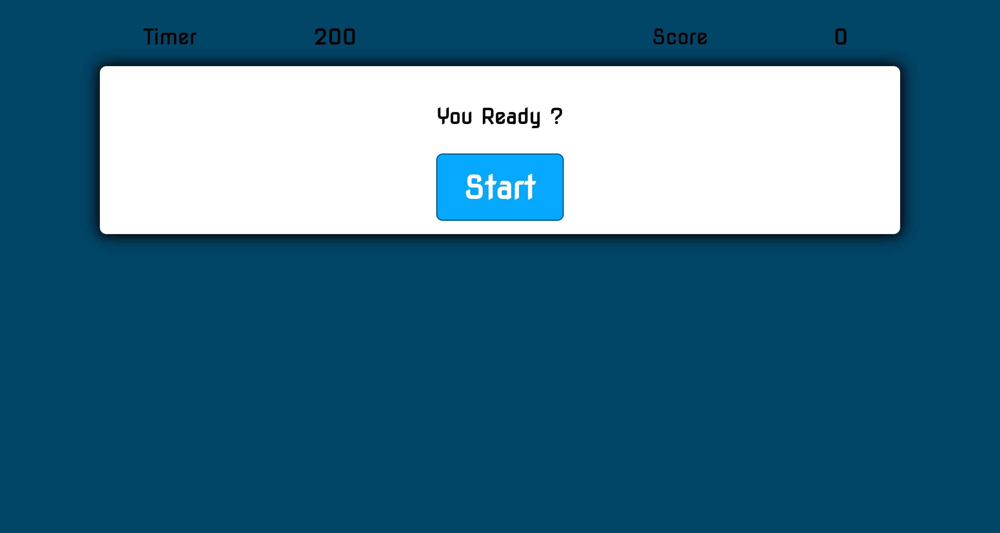

# JavaScript:Quiz



## Description

 A timed coding quiz with multiple-choice questions. Which runs in the browser and features dynamically updated HTML and CSS powered by JavaScript code. 

## Task

This Challenge invites you to build a timed coding quiz with multiple-choice questions. This app will run in the browser and will feature dynamically updated HTML and CSS powered by JavaScript code that you write. It will have a clean, polished, and responsive user interface.

## What I learned

With this project I learned a lot !
- How to utilize JavaScript's methods on manipulating the dom
- More about the power of functions
- The difficulty of thinking Logical for a "noob"
- Making comments within ones code is valuable not only for self, but others as well
- Arrow functions are nice "syntax sugar" but also can be very efficient
- It's just gonna take more time to truly understand all of the code, but having some type of understanding and perseverance is a major key when learning
- It's okay to get "help"


## Acceptance Criteria

```
GIVEN I am taking a code quiz
WHEN I click the start button
THEN a timer starts and I am presented with a question
WHEN I answer a question
THEN I am presented with another question
WHEN I answer a question incorrectly
THEN time is subtracted from the clock
WHEN all questions are answered or the timer reaches 0
THEN the game is over
WHEN the game is over
THEN I can save my initials and my score
```

## RoadMap
- Code could be updated to be more efficient
- Could add a few extra game features
- UI could be "cleaner" and more responsive

## Sources

[https://youtu.be/riDzcEQbX6k](https://youtu.be/riDzcEQbX6k)

[https://github.com/nucleargriff](https://github.com/nucleargriff)

[https://chat.openai.com/chat](https://chat.openai.com/chat)


